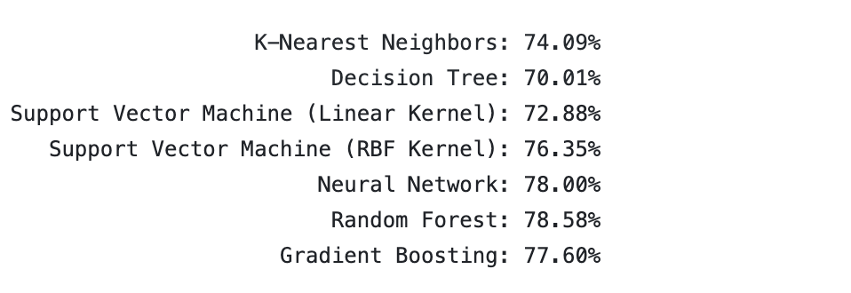
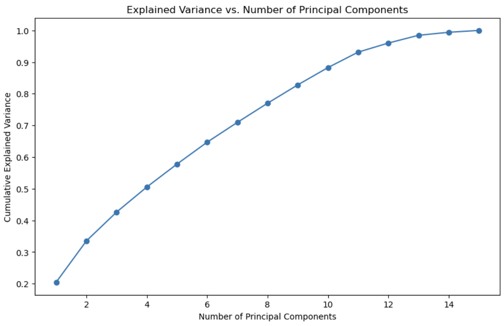
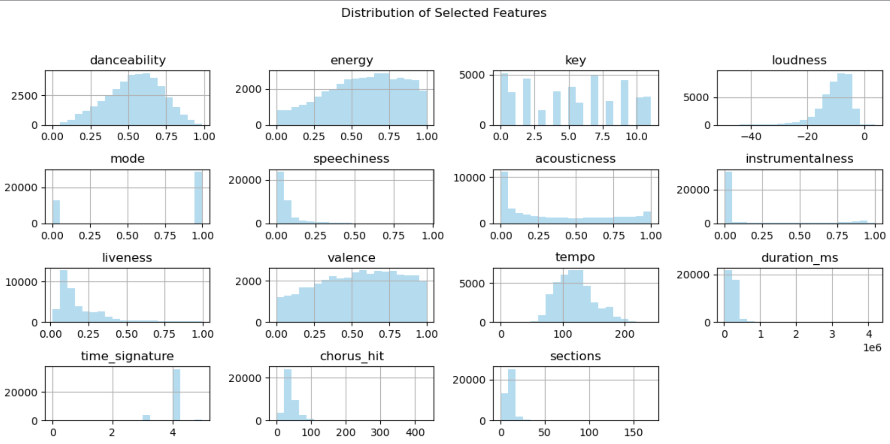
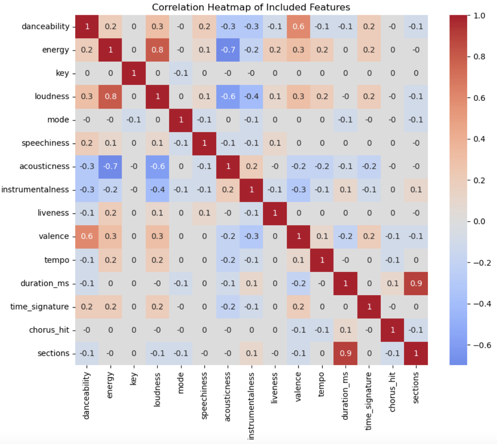
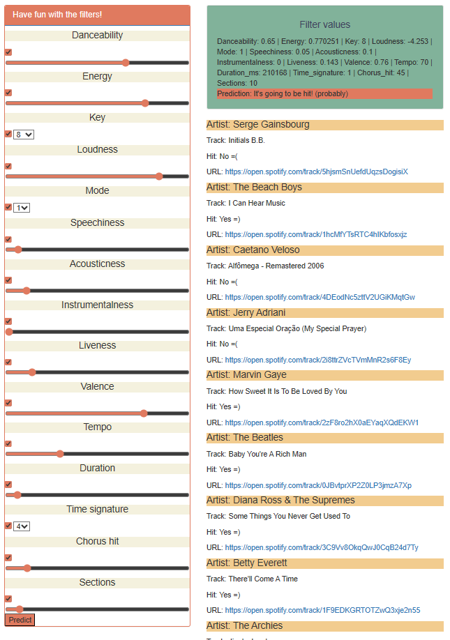

# Proyect 4: Spotify hit predictor

link to presentation:
https://www.canva.com/design/DAFtiKpTyWM/kKrdtIOxYsUkjBtKR6mWRw/edit?utm_content=DAFtiKpTyWM&utm_campaign=designshare&utm_medium=link2&utm_source=sharebutton

## Introduction

This dataset consists of features for tracks fetched using Spotify's Web API. The tracks are labeled '1' or '0' ('Hit' or 'Flop'). It has 20 columns and 41,160 rows.

The variables contained in the data set are:

- Danceability: how suitable a track is for dancing
- Energy: a perceptual measure of intensity and activity
- Loudness: the overall loudness of a track in decibels.
- Mode: indicates the modality (major or minor)
- Speechiness: detects the presence of spoken words in a track
- Acousticness: whether the track is acoustic
- Liveness: presence of an audience in the recording
- Valence: the musical positiveness conveyed by a track

## Data Preporcessing

- We merged 6 csv files with information from the 60's until 2010´s 
- We renamed columns to make it more clear and easy to follow
- Change decade variable to integer
- Revised data types to ensure we could work with the information
- Reviewd that there where no NA
- Droped Categorical Data
- Trained using - Test Split

## Selecting the Model

We evalauted the accuracy of different models to identify the ones with the highest scores: 

Random Forest and Neural Network where the models showing the greatest accuracy. We went with randmo Forest given the accuracy and simplicity vs. Neayral Networks

To do this evaluation we used a code shared within kaggle by GABRIEL ATKI that presented a very useful and quick way to asses many models at once

## Working with the Model

### Data Description:

Link to tableau presentation: https://public.tableau.com/views/SpotifyStroy/Story1?%3Alanguage=en-US&publish=yes&%3Adisplay_count=n&%3Aorigin=viz_share_link

We selected Tableau as our visualization to identify the key insights of our data:

- Top Artists by Number of Songs: Visualized the artists with the most tracks across every decade and highlighted in Colors we can see the Artists that have hits. We can clearly see that more songs not necessarly means you'll get a hit!
- Tracks & Hits decade over decade:  Visualized by decade the th number of Tracks vs Number of hits. The 60s was a good decade for music with a large prodiction of tracks and great artists thus with a great number of Hits. But if we consider this as proportion, the % of hits are very balanced across time.
- Relevant Attributes that define if the tracks are Hits: Visualized the main attributes to define if the track is a hit or not.  the # 1 in th Hit Column indicates that is a Hit and the 0 that is not a Hit.
- Top 30 Artists by number of Hits: Observed the top 30 Artists with more hits across decades ranging from The beatles with almost 60 hits to Diana Ross with around 30 hits.
- Tracks by decade for the Top 30 Hit Artists: Displayed by artist which decade have more or less  hits. The 60's where a bussy decade for artists like the Beatles and the Beach boys, the 80's did not get a lot of Hits but Elton Jhon,  Madonna and Michel Jackson were very relevant. Madona maged to be the artist with mor its in the 90s and Taylor Swift and Drake domianted the 2010's.
- Top 30 Hit Artist's Tracks Loudnes, Danceability and Duration: displayed an interactive visualization to slect song and go to sopifty to listen to them. You can select the more danceable songs ranging from red (more) to blue (less). And loudest songs ranging from big (more) to small (less) and also you can see the duration in the "y" axis 

### Data Distribution:

In order to understand the dtaa distribution we performed several analysis in the code such as:

#### PCA to find the number of components needed to explain a certain threshold of variance

#### Visualizing the distribution of features using histograms 

#### Visualizing correlations between features

To do this visualizations we used a code shared within kaggle by ASHOK ARORA that presented a very useful and quick way visualize the data in the code

### Databae and Predictor:
We used Mongo DB for the database.

We developed a web based Hit Predictor where you can play with the different variables to identify whic combination can determine if a song with such characteristics will be a Hit or not. 

## Conclusion

The classification model predicts whether a track would be a 'Hit' or not based on the premiss that pop music success  can be the result of a recepie or formula. Which could hve big relevance in the music industry

We observe that Hits are:

- Less Acoustic
- Have more energy 
- Are more danceble 
- Are not instrumetal

By following the right convination of factors in a very precise way we are able to vislualize with our model the song that are hits. Therefore we ca conclude that there can be a formula or a recepie for a winning song but this combinaton must be done in a very specific combination that might require slight variations as time goes by

### Example of a winning combination for a hit

